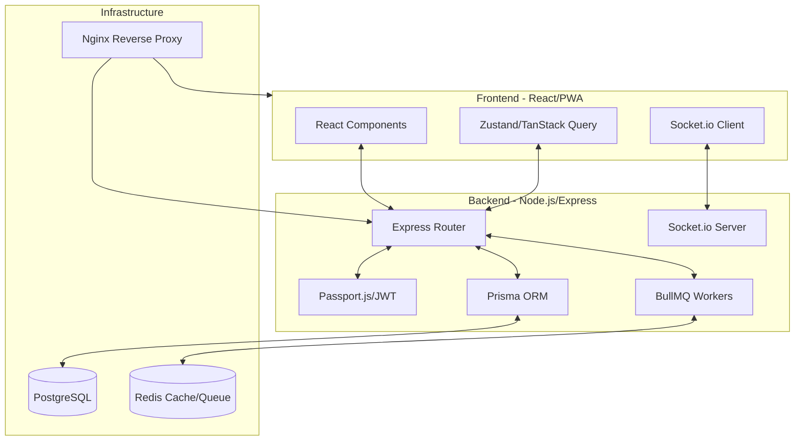
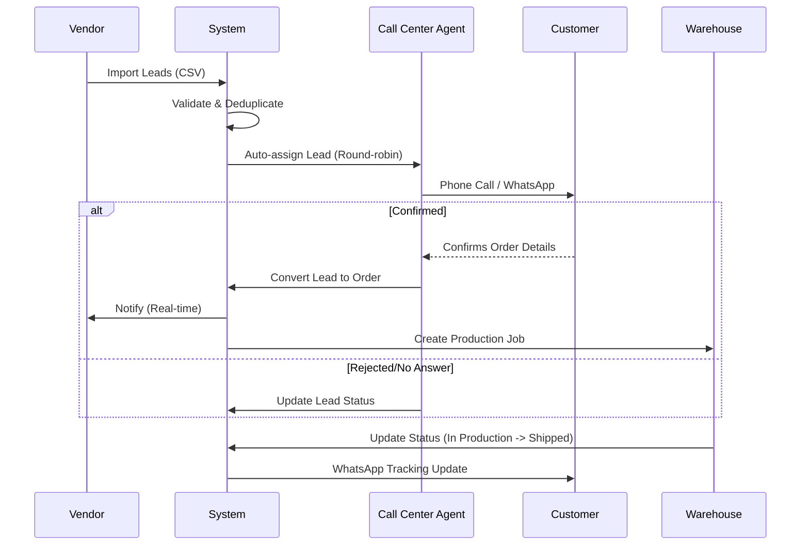
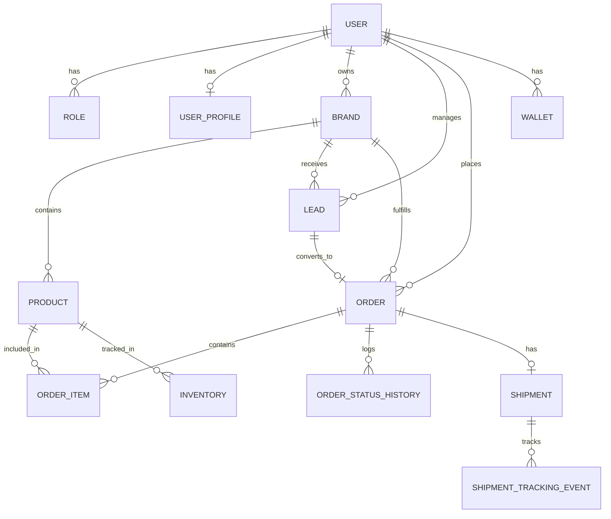

# Technical Documentation & System Architecture

This document provides a deep dive into the technical architecture, data structures, and workflows of the SILACOD platform.

## 1. System Architecture

The system follows a decoupled architecture with a TypeScript-based full-stack environment.

## 2. Core Business Workflow (Lead to Order)

The lifecycle of a sale in the Moroccan dropshipping context:

## 3. Database Schema Structure

The PostgreSQL schema is optimized for Moroccan e-commerce, supporting multiple roles and complex relationships.

## 4. Key Components & Services

### Security & Authentication
- **Passport.js**: Integrated for Google OAuth and JWT strategies.
- **Helmet & Rate Limiting**: Protection against common web vulnerabilities and brute-force attacks.
- **Audit Logging**: Every sensitive action (admin edits, balance updates) is logged.

### Communication Services
- **WhatsApp Business API**: Automated order confirmations, OTPs, and delivery updates.
- **Twilio SMS**: Fallback for verification codes.
- **Nodemailer**: Transactional emails for account updates.

### Queue Management (BullMQ)
Used for asynchronous processing to ensure high performance:
- `lead-assignment`: Distributes incoming leads to available agents.
- `notifications`: Handles real-time push and messaging.
- `order-processing`: Manages complex status transitions and wallet credits.

## 5. Deployment Information (Hostinger VPS)
- **Web Server**: Nginx (Reverse Proxy with SSL via Certbot)
- **Process Management**: PM2 (Auto-restart on failure)
- **PWA**: Offline-first strategy with Service Workers.
